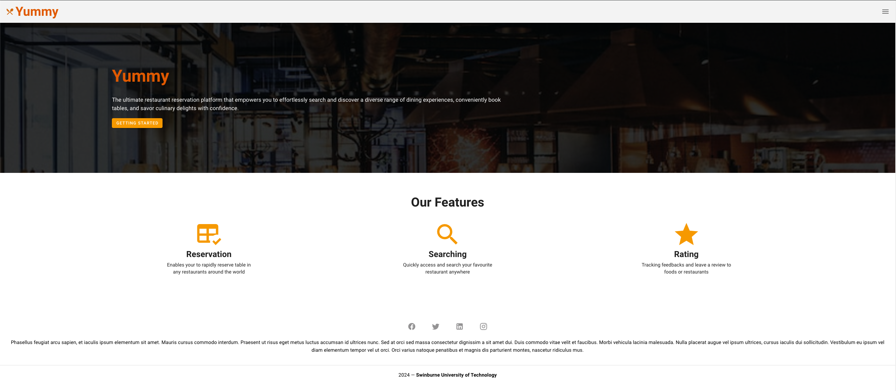
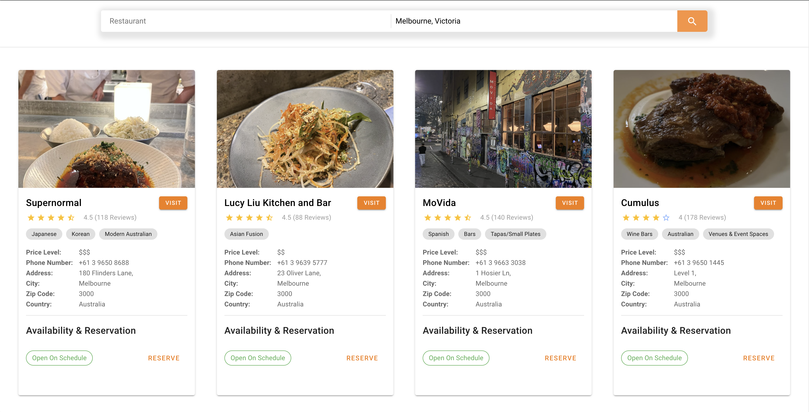
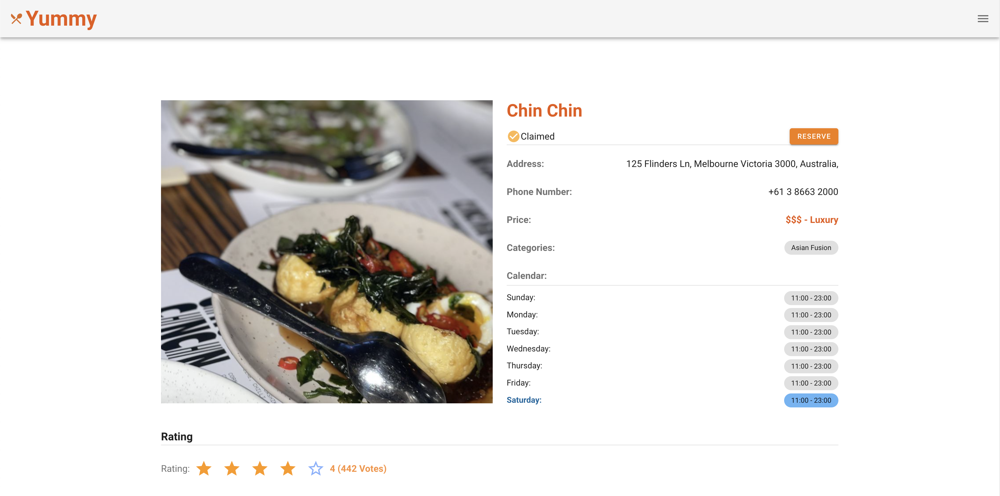
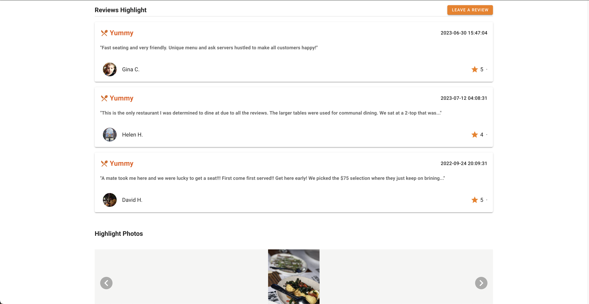
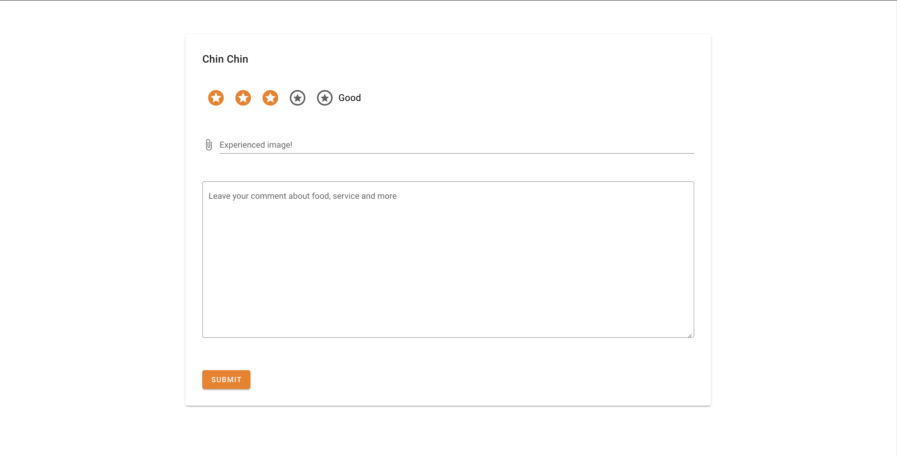

# Yummy Vue Project

## Overview
<p>This project aimed at creating a responsive web application which empowered users to share 
and access crowdsources dining establishment reviews from around the world. The project adopted Yelp Fusion API
for data retrieval.
</p>

<p>The project is a custom project in the unit Interface Design and Development at Swinburne University.
The project is an interface-based web project so there is no backend or server development. The deployment of the project
was comprehensively in Amazon Web Services</p>



## Technologies
- Front-end: [VueJS](https://v2.vuejs.org/), [TailwindCSS](https://tailwindcss.com/docs/installation), [Vuetify](https://vuetifyjs.com/en/)
- API: [Yelp Fusion API](https://docs.developer.yelp.com/docs/fusion-intro)
- Deployment: [Amazon CloudFront](https://aws.amazon.com/cloudfront/), [Amazon S3](https://aws.amazon.com/s3/)

## Project setup
### 1. Install packages and dependencies
```bash
npm install
```

### 2. Start The Application
<span>Before running the application, please [install packages and dependencies](#1-install-packages-and-dependencies). Run the following command after all the packages and dependencies have been installed</span>

```bash
npm run serve
```

### 3. Compiles and minifies for production
```bash
npm run build
```


### 5. Set Up Yelp Fusion API

This project requires an external API called Yelp API which enables the application to retrieve the information about restaurants
and their reviews throughout the world. For more information about Yelp API, please refer to [Yelp Fusion API Documentation](https://docs.developer.yelp.com/docs/fusion-intro).
<br/>

## Features

### Search Your Restaurant


### Tracking Restaurant Details


### Tracking The Reviews


### Leave A Review



